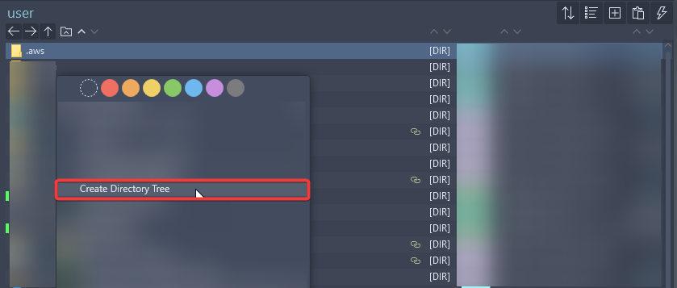
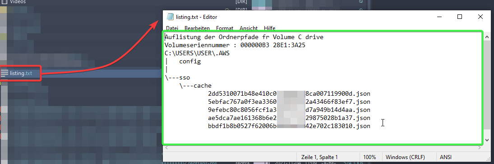

# Windows Explorer Context Menu Extension Script - List Files in a Directory
This repository contains Python scripts that add and remove a custom context menu entry in Windows Explorer. These scripts only affect the context menu for the current user.

The [command](https://github.com/marcmantei/WindowsFolderTreeContextMenu/blob/8947a889ee94099c9dc57be3ee72eb55b522aa0c/add_CreateFolderTree_to_contextclick_menu_currentUser.py#L25) run on-right-click is:
```batch
cmd.exe /c tree "%1" /A /F > "%1"\\..\\listing.txt'
```

1. 
2. 

## Scripts
1. **add_context_menu_entry.py**: This script adds a context menu entry, 'Create Directory Tree', to the context menu that appears when you right-click a folder in Windows Explorer. When this entry is clicked, it runs the tree command in the right-clicked folder and outputs the result into a text file named listing.txt in the parent directory of the right-clicked folder.

2. **remove_context_menu_entry.py**: This script removes the 'Create Directory Tree' entry from the context menu.

## How to Run
#### Prerequisites: Ensure you have Python installed on your machine. The scripts were tested with Python 3.7 and above.

### Add the Context Menu Entry
1. Open your terminal (e.g., Command Prompt, PowerShell).
2. Navigate to the directory containing add_context_menu_entry.py.
3. Run the script with the command:
```batch
python add_context_menu_entry.py
```
### Remove the Context Menu Entry
1. Open your terminal (e.g., Command Prompt, PowerShell).
2. Navigate to the directory containing remove_context_menu_entry.py.
3. Run the script with the command:
```batch
python remove_context_menu_entry.py
```

**Note:** Please backup your Windows Registry before running these scripts as they modify the registry.